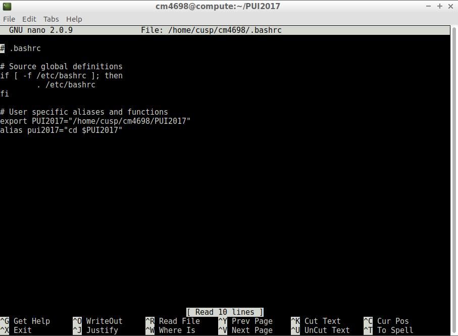
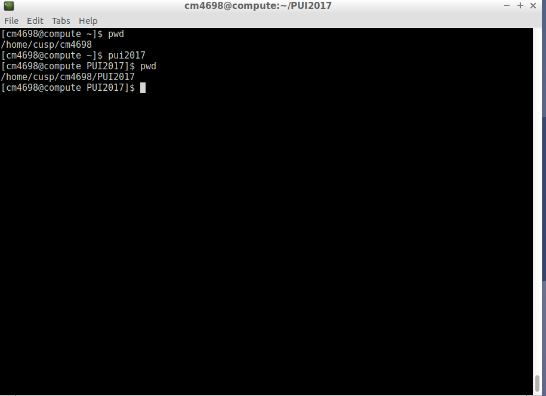

# PUI2017_cm4698

Assignment 1

Created gittest_cmoffett using the mkdir command. Used git remote, git add, and git push to push
this new repo to Github. Had Gaurav ( mess with my repo, and resolved the merge conflict.

Assignment 2

To set up my environment I first created an environment variable 'PUI2017' set to the folder path where I plan to store my assignments for PUI 2017. My next step was to create an alias that uses the 'cd' command to open that folder, so that anytime I type the alias name 'pui2017' I'm able to access the folder immediately.

